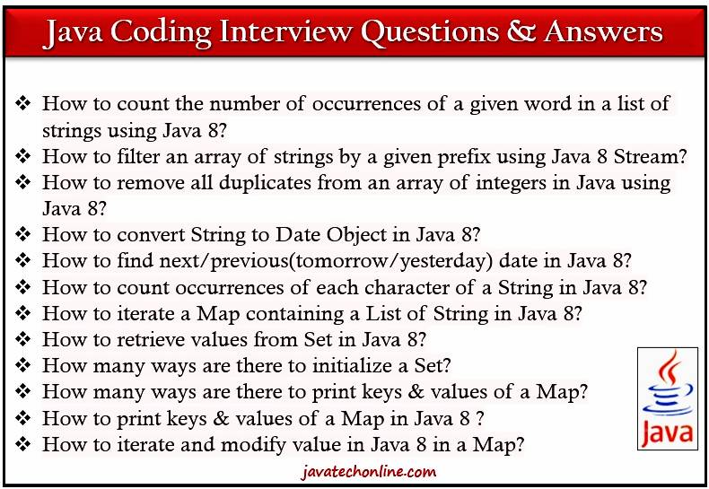
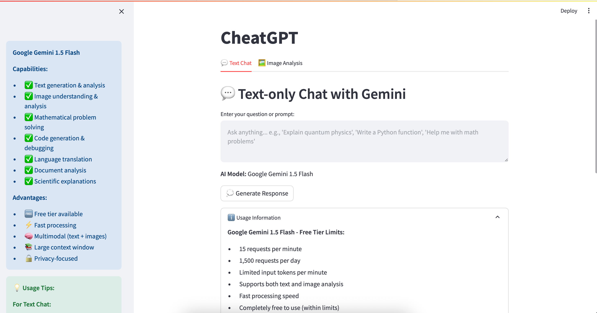
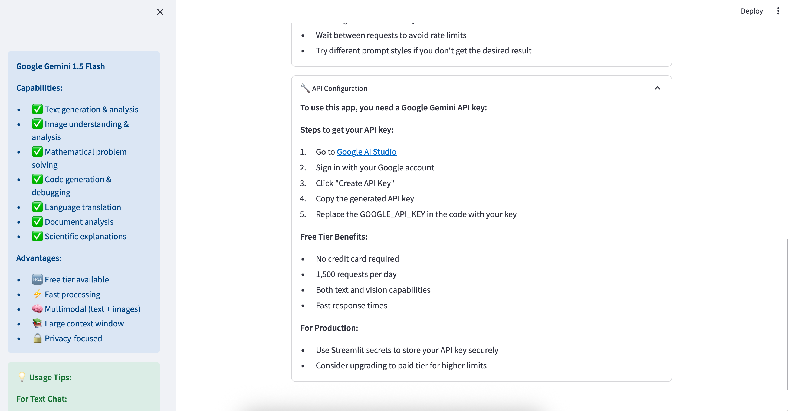
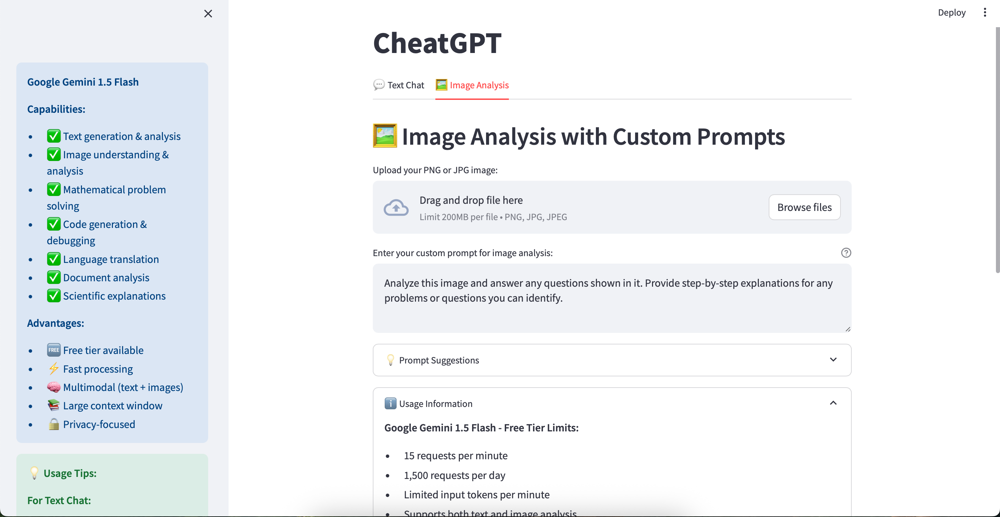

# CheatGPT

CheatGPT is a Streamlit web application that leverages the Google Gemini 1.5 Flash API to provide advanced AI-powered text chat and image analysis capabilities. It allows users to interact with the AI model through text prompts or by uploading images for detailed analysis with custom prompts.

## Features

- 💬 Text-only chat with Google Gemini 1.5 Flash
- 🖼️ Image analysis with custom prompts and prompt suggestions
- Academic help including math problem solving, science explanations, and text summarization
- Analysis of charts, graphs, and multiple-choice questions in images
- Handles Google API quota limits gracefully with user guidance
- Usage tips and API configuration instructions included in the UI

## Project Screenshots

Add screenshots of the project here to showcase the UI and features. You can add images using Markdown syntax:

```markdown

```

Example:


*Text Chat interface with Google Gemini*


*Image Analysis tab with custom prompt*


*Prompt suggestions for image analysis*

## Installation

1. Clone this repository or download the source code.
2. Ensure you have Python 3.7 or higher installed.
3. It is recommended to create a virtual environment:

```bash
python3 -m venv venv
source venv/bin/activate  # On Windows use `venv\Scripts\activate`
```

4. Install the required dependencies:

```bash
pip install -r requirements.txt
```

## Usage

1. Obtain a Google Gemini API key:

   - Visit [Google AI Studio](https://makersuite.google.com/app/apikey)
   - Sign in with your Google account
   - Create and copy your API key

2. Replace the `GOOGLE_API_KEY` variable in `cheatgpt.py` with your API key. For production, consider using Streamlit secrets to store your key securely.

3. Run the Streamlit app:

```bash
streamlit run cheatgpt.py
```

4. Use the web interface to interact with the AI via text chat or image analysis.

## API Quota Limits

- 15 requests per minute
- 1,500 requests per day
- Limited input tokens per minute
- Free tier with no credit card required

If you exceed the quota, the app will notify you with options to wait, upgrade, or try later.

## Tips for Better Results

- Be specific in your prompts.
- For math problems, ask for step-by-step solutions.
- For images, describe what you want to focus on.
- Wait between requests to avoid rate limits.
- Try different prompt styles if you don't get the desired result.

## Security Note

For production deployments, do **not** hardcode your API key in the script. Use Streamlit secrets or environment variables to manage your API key securely.

## License

This project is provided as-is without any explicit license. Please use responsibly.
